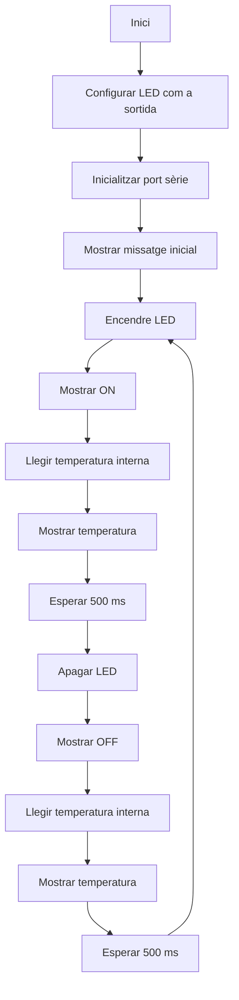
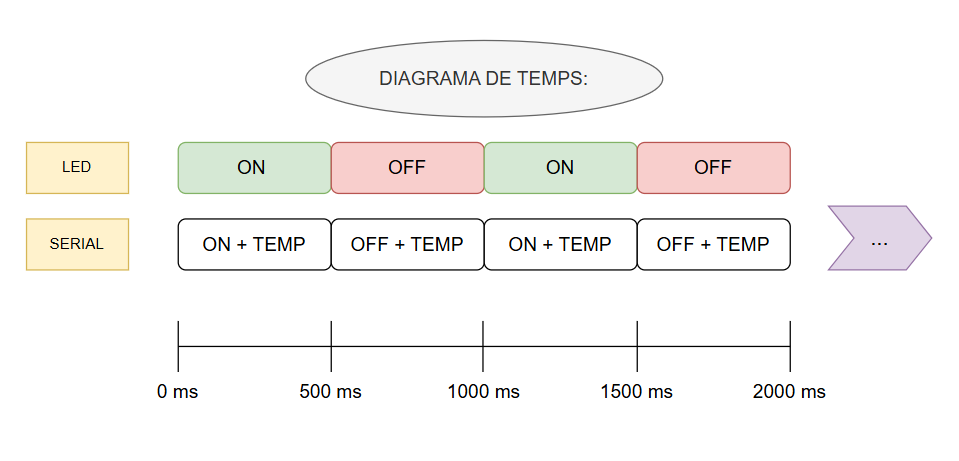
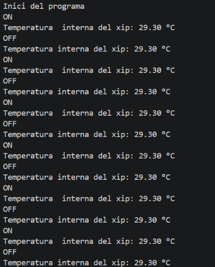

# Pràctica 1: Blink

Alumnes: **Martí Cabanes i Adriana Bosch**

## Objectiu

L’objectiu principal d’aquesta pràctica és produir el parpelleig periòdic d’un LED utilitzant una placa ESP32. Per tal de poder seguir el funcionament del programa i depurar-lo, també s’utilitza la sortida sèrie, mostrant els missatges `ON` i `OFF` cada vegada que canvia l’estat del LED.

A més de la part obligatòria de la pràctica, s’ha incorporat una de les millores voluntàries proposades: la lectura de la temperatura interna del xip. En lloc de desenvolupar aquesta millora com un programa separat, s’ha decidit integrar-la dins del mateix funcionament del blink. D’aquesta manera, cada vegada que el LED canvia d’estat, el programa també llegeix la temperatura interna i mostra el valor pel port sèrie.

Per tant, el codi final és una combinació entre la pràctica principal i l’exercici voluntari de millora. Això permet comprovar alhora el control d’una sortida digital, la comunicació pel port sèrie i la lectura d’un valor intern de la placa ESP32.

## Funcionament del programa

El programa realitza les següents accions:

1. Configura el pin del LED com a sortida.
2. Inicialitza el port sèrie a 115200 bauds.
3. Encén el LED.
4. Mostra el missatge `ON` pel port sèrie.
5. Llegeix la temperatura interna del xip.
6. Mostra la temperatura pel port sèrie.
7. Espera 500 ms.
8. Apaga el LED.
9. Mostra el missatge `OFF` pel port sèrie.
10. Torna a llegir i mostrar la temperatura.
11. Espera 500 ms.
12. Repeteix el procés indefinidament.

## Codi complet

```cpp
#include <Arduino.h>

#define LED_PIN 48

void setup() {
  pinMode(LED_PIN, OUTPUT);
  Serial.begin(115200);

  delay(1000);
  Serial.println("Inici del programa");
}

void loop() {
  digitalWrite(LED_PIN, HIGH);
  Serial.println("ON");

  float tempC = temperatureRead();
  Serial.print("Temperatura interna del xip: ");
  Serial.print(tempC);
  Serial.println(" ºC");

  delay(500);

  digitalWrite(LED_PIN, LOW);
  Serial.println("OFF");

  tempC = temperatureRead();
  Serial.print("Temperatura interna del xip: ");
  Serial.print(tempC);
  Serial.println(" ºC");

  delay(500);
}
```

## Explicació del codi

### Inclusió de la biblioteca

```cpp
#include <Arduino.h>
```
### Definició del pin del LED

```cpp
#define LED_PIN 48
```

Aquesta línia defineix el pin utilitzat per controlar el LED. En aquest cas s’ha utilitzat el pin 48.

### Funció setup

```cpp
void setup() {
  pinMode(LED_PIN, OUTPUT);
  Serial.begin(115200);

  delay(1000);
  Serial.println("Inici del programa");
}
```

La funció `setup()` s’executa una sola vegada quan s’inicia la placa. En aquesta funció es configura el pin del LED com a sortida i s’inicialitza la comunicació sèrie a 115200 bauds.

### Funció loop

```cpp
void loop() {
  digitalWrite(LED_PIN, HIGH);
  Serial.println("ON");

  float tempC = temperatureRead();
  Serial.print("Temperatura interna del xip: ");
  Serial.print(tempC);
  Serial.println(" ºC");

  delay(500);

  digitalWrite(LED_PIN, LOW);
  Serial.println("OFF");

  tempC = temperatureRead();
  Serial.print("Temperatura interna del xip: ");
  Serial.print(tempC);
  Serial.println(" ºC");

  delay(500);
}
```

La funció `loop()` s’executa contínuament. Primer encén el LED, envia el missatge `ON` pel port sèrie, llegeix la temperatura interna del xip i espera 500 ms. Després apaga el LED, envia el missatge `OFF`, torna a llegir la temperatura i espera 500 ms més.

## Diagrama de flux



## Diagrama de temps

El diagrama de temps mostra el comportament periòdic del programa. El LED roman encès durant 500 ms i apagat durant 500 ms. Cada vegada que el LED canvia d’estat, el programa envia pel port sèrie el missatge corresponent, ON o OFF, juntament amb la lectura de la temperatura interna del xip. Aquest cicle es repeteix indefinidament dins de la funció loop().



## Temps lliure del processador

Cada cicle complet del programa dura aproximadament 1000 ms:

- 500 ms amb el LED encès.
- 500 ms amb el LED apagat.

Durant aquest temps, el processador només executa unes poques instruccions: canviar l’estat del LED, enviar missatges pel port sèrie i llegir la temperatura interna del xip.

La major part del temps el programa està dins de la funció `delay()`. Per tant, el processador es troba esperant i no realitza cap altra tasca útil.

Es pot considerar que el processador té pràcticament tot el temps lliure, aproximadament un 99%, ja que el temps real d’execució de les instruccions és molt petit comparat amb els 1000 ms totals del cicle.

## Millora voluntària

Com a exercici voluntari de millora de nota, s’ha afegit la lectura de la temperatura interna del xip mitjançant la funció `temperatureRead()`.

El valor de temperatura es mostra pel monitor sèrie juntament amb l’estat del LED.

## Conclusions

En aquesta pràctica s’ha implementat el parpelleig periòdic d’un LED amb una placa ESP32. També s’ha utilitzat el port sèrie per mostrar l’estat del LED mitjançant els missatges `ON` i `OFF`.

A més, s’ha ampliat el programa amb la lectura de la temperatura interna del xip, fet que permet comprovar l’ús de funcions addicionals de la placa i mostrar dades pel monitor sèrie.

Finalment, s’ha après a documentar el funcionament del programa mitjançant un fitxer Markdown, incloent-hi el codi, un diagrama de flux, un diagrama de temps i una explicació del temps lliure del processador.

## Resultat al monitor sèrie

